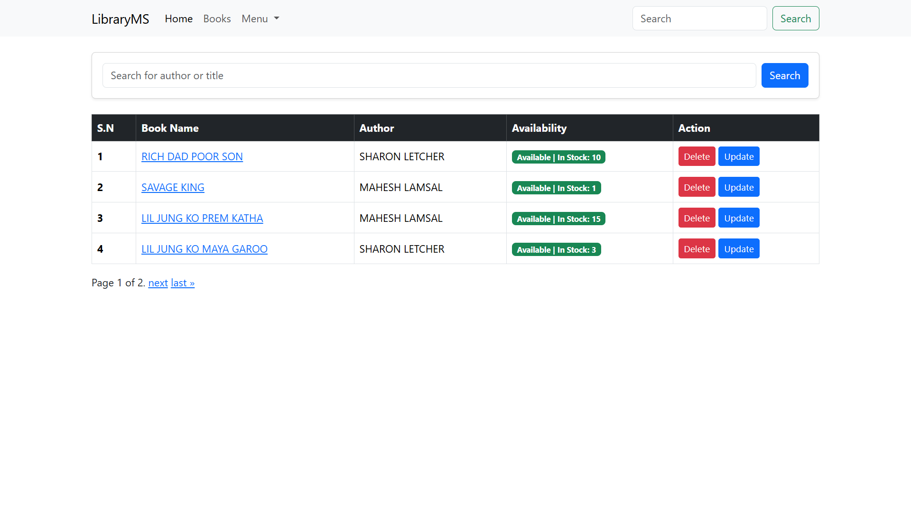
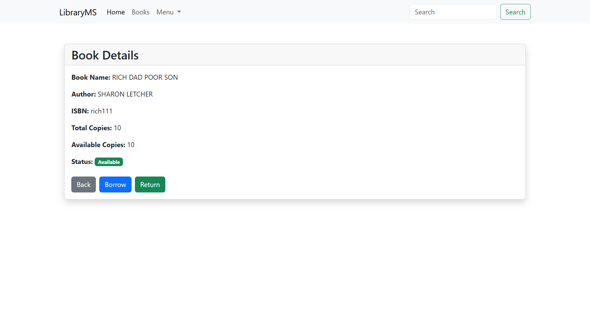
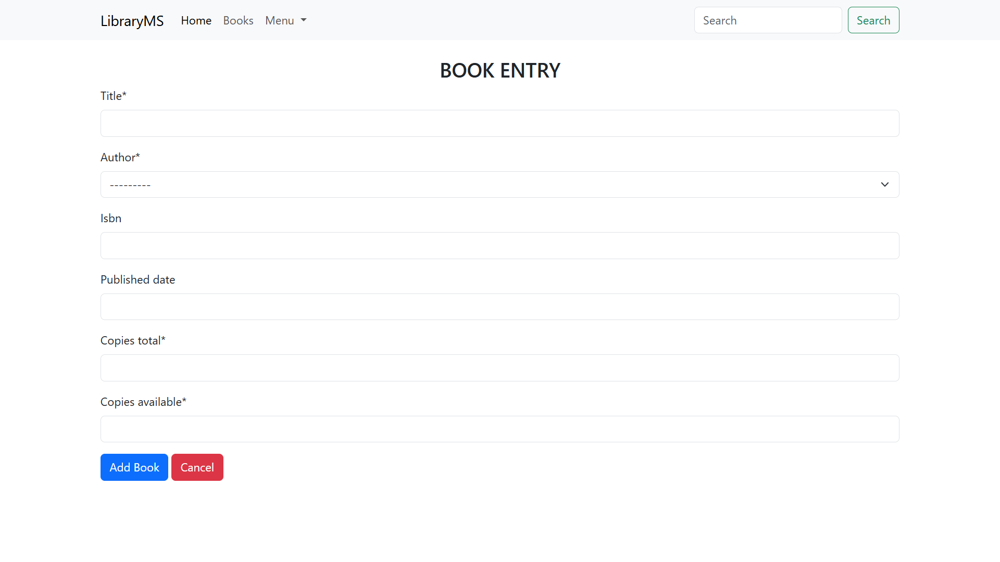

# 📚 Library Management System

A **Library Management System** built with **Django** that enables librarians to manage books and authors efficiently. The application supports full CRUD (Create, Read, Update, Delete) operations, book borrowing and returning, and automatically tracks book availability. The project follows Django's MVT (Model-View-Template) architecture and uses Bootstrap 5 for a responsive and user-friendly interface.

---

## 🚀 Features Implemented

### 📖 Author Management
- Add a new author
- View all authors
- View author details
- Update author information
- Delete an author with confirmation

### 📚 Book Management
- Add a new book
- View all books
- View detailed information for each book
- Update book information
- Delete a book with confirmation

### 🔄 Borrow & Return System
- Borrow books (decreases available copies)
- Return books (increases available copies)
- Prevent borrowing when no copies are available
- Prevent returning more than the total number of copies
- Automatically display book availability status

### 🛠 Django Admin
- Manage authors and books through the Django Admin panel
- Customized admin list display

### 🎨 User Interface
- Responsive Bootstrap 5 layout
- Navigation bar for easy navigation
- Template inheritance using `base.html`

---

## ⭐ Bonus Features

- 🔍 Search books by title
- 📄 Pagination on the book list page

---

## 🛠 Technologies Used

- Python 3
- Django
- SQLite3
- Bootstrap 5
- HTML5
- CSS3

---

# ⚙️ Setup & Installation

## 1. Clone the repository

```bash
git clone https://github.com/Mahesh-179/Library-Management-System.git
```

## 2. Navigate to the project directory

```bash
cd Library-Management-System
```

## 3. Create and activate a virtual environment (Optional)

### Windows

```bash
python -m venv venv
venv\Scripts\activate
```

### Linux/macOS

```bash
python3 -m venv venv
source venv/bin/activate
```

## 4. Install the required packages

```bash
pip install -r requirements.txt
```

## 5. Apply database migrations

```bash
python manage.py migrate
```

## 6. (Optional) Create a superuser

```bash
python manage.py createsuperuser
```

## 7. Run the development server

```bash
python manage.py runserver
```

Open your browser and visit:

```
http://127.0.0.1:8000/
```

---

## 📸 Screenshots

### 📚 Book List Page



---

### 📖 Book Detail Page



---

### ➕ Add Book Page



---

## 📂 Project Structure

```
Library-Management-System/
│
├── manage.py
├── requirements.txt
├── README.md
├── screenshots/
│   ├── book-add.png
│   ├── book-details.png
│   └── book-display.png
├── department/
├── templates/
├── static/
└── db.sqlite3
```

---

## 👨‍💻 Author

**Mahesh Lamsal**

- GitHub: https://github.com/Mahesh-179
- Repository: https://github.com/Mahesh-179/Library-Management-System

---

## 📄 License

This project was developed as part of a Django course assignment for educational purposes.
